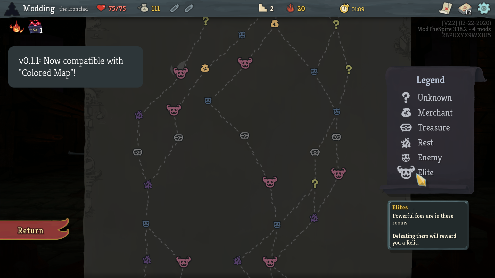

## Dark Map

Gives the map a dark theme for the late night spire slayer.


### Notes
* As of version 0.1.1, this mod now supports customization via the "Colored Map" mod! It now checks for the presence of the mod and lets its customizations take priority. Hopefully it should work as normal without it!



Creating color schemes is very difficult, so if you manage to create a really nice one, please send me your ColoredMapPrefs file! (Start an issue here on Github, PM me, or whatever!)

The one in the screenshot above is:
```json
{
  "M_red_icon": "0.29220927",
  "M_green_icon": "0.3711569",
  "M_blue_icon": "0.46428594",
  "M_alpha_outline": "1.0",
  "M_red_outline": "0.0928557",
  "M_green_outline": "0.10323752",
  "M_blue_outline": "0.10722125",
  "E_red_icon": "0.56264544",
  "E_green_icon": "0.33920845",
  "E_blue_icon": "0.4176036",
  "E_alpha_outline": "1.0",
  "E_red_outline": "0.0928557",
  "E_green_outline": "0.10323752",
  "E_blue_outline": "0.10722125",
  "R_red_icon": "0.33921057",
  "R_green_icon": "0.24902132",
  "R_blue_icon": "0.42158946",
  "R_alpha_outline": "1.0",
  "R_red_outline": "0.08804082",
  "R_green_outline": "0.10323752",
  "R_blue_outline": "0.10722125",
  "$_red_icon": "0.8021463",
  "$_green_icon": "0.6449176",
  "$_blue_icon": "0.39787757",
  "$_alpha_outline": "1.0",
  "$_red_outline": "0.0928557",
  "$_green_outline": "0.10323752",
  "$_blue_outline": "0.10722125",
  "T_red_icon": "0.4843782",
  "T_green_icon": "0.4847306",
  "T_blue_icon": "0.48411813",
  "T_alpha_outline": "1.0",
  "T_red_outline": "0.0928557",
  "T_green_outline": "0.10323752",
  "T_blue_outline": "0.10722125",
  "?_red_icon": "0.5626438",
  "?_green_icon": "0.5627372",
  "?_blue_icon": "0.33567214",
  "?_alpha_outline": "1.0",
  "?_red_outline": "0.0928557",
  "?_green_outline": "0.10323752",
  "?_blue_outline": "0.10722125"
}
```

To use it, open up your Slay the Spire install directory. If you're on the main branch, there should be a folder called "preferences". Inside that folder should be a file called something like "1_ColoredMapPrefs" (the prefix is your profile identifier, this is on my first profile, so its labeled as 1 here). So this file is located somewhere like: ``` SlayTheSpire/preferences/1_ColoredMapPrefs ```

Beta branch versions of the game (I believe) will store the ColoredMapPrefs file inside the ```SlayTheSpire/betaPreferences``` folder instead.

Simply open up that file in a text editor of your choice and replace its contents with everything in the code block above ^. **Make sure to do this while the game is not running.** 

Once you launch the game, the ColoredMap mod will read from this file (hopefully) and use the example color scheme. If it's not working (after double-checking that both DarkMap and ColoredMap are enabled), the culprit is probably editing the wrong file. If you edit the settings in game and then quit, you can look at your preferences folder and see if some other file is being written to instead (sort by modification time, for example).

Again, only edit the file manually **while the game is not running** as the ColoredMap mod only looks at the config file during certain times and keeps a lot of it in memory instead - meaning it will likely overwrite any changes.

### Additional Info
* This mod is a spin off of my upcoming map improvement mod (which itself is a sequel to BetterPaths) - when that project releases this mod will most likely be obsolete (and incompatible as it will touch the same code). Stay tuned for that mod in the near future.
* This mod will likely not see any further updates and is only being released as a small hold-over until the main map mod is completed.

### Installation

Requires ModTheSpire and BaseMod (find them on the Steam Workshop).

To install this mod, download the latest version at the [releases page](https://github.com/casey-c/DarkMap/releases) and place them into your SlayTheSpire/mods folder.

### Issues / Feedback

If you run into bugs, incompatibilities, or have further suggestions, please let me know about them over on the [issues page](https://github.com/casey-c/DarkMap/issues).
