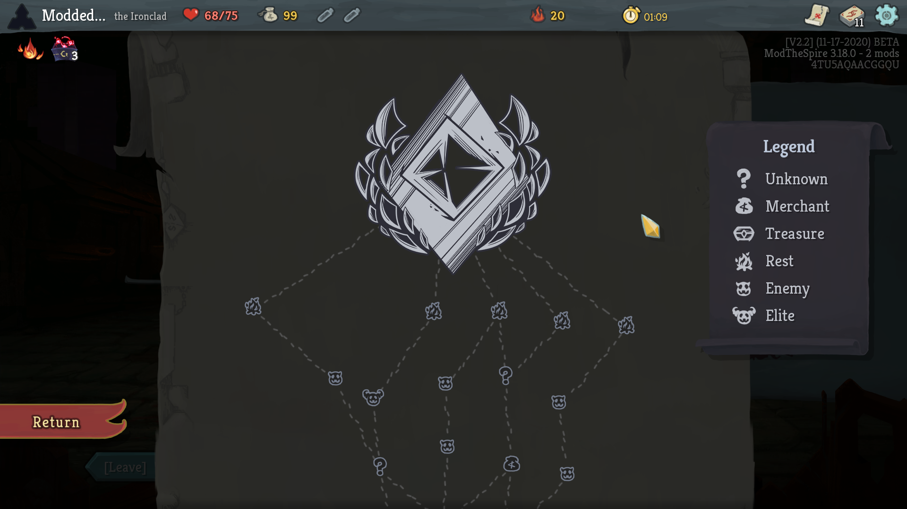
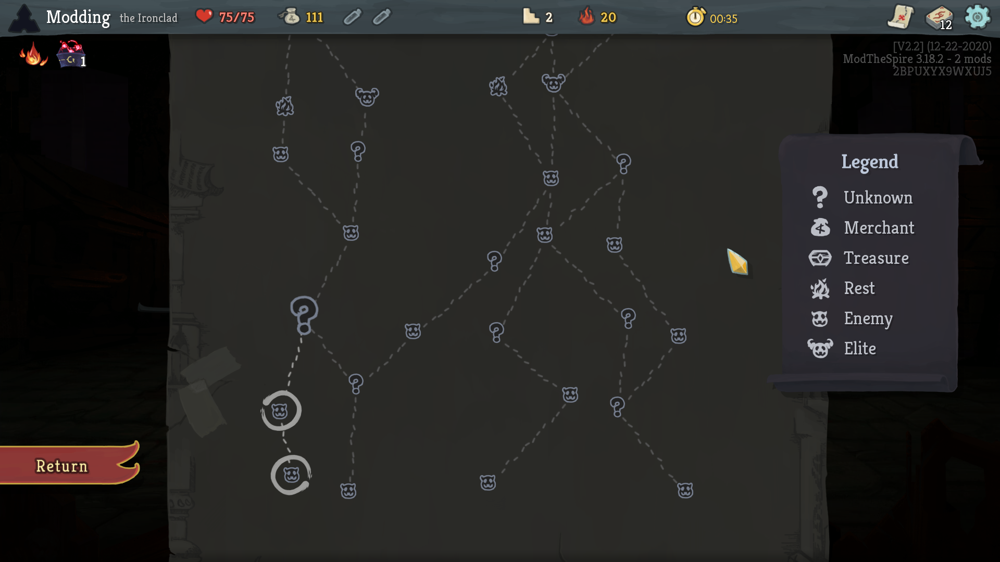

## Dark Map

Gives the map a dark theme for the late night spire slayer.

### Notes
* Due to how it patches the base game render calls, it is most likely incompatible with other map coloring mods (e.g. colored map nodes etc.)

### Additional Info
* This mod is a spin off of my upcoming map improvement mod (which itself is a sequel to BetterPaths) - when that project releases this mod will most likely be obsolete (and incompatible as it will touch the same code). Stay tuned for that mod in the near future.
* This mod will likely not see any further updates and is only being released as a small hold-over until the main map mod is completed.

### Installation

You can use the workshop link: [https://steamcommunity.com/sharedfiles/filedetails/?id=2348942418](https://steamcommunity.com/sharedfiles/filedetails/?id=2348942418)

Requires ModTheSpire and BaseMod (find them on the Steam Workshop).

To install this mod manually, download the latest version at the [releases page](https://github.com/casey-c/DarkMap/releases) and place the JAR file into your SlayTheSpire/mods folder.

### Issues / Feedback

If you run into bugs, incompatibilities, or have further suggestions, please let me know about them over on the [issues page](https://github.com/casey-c/DarkMap/issues).
