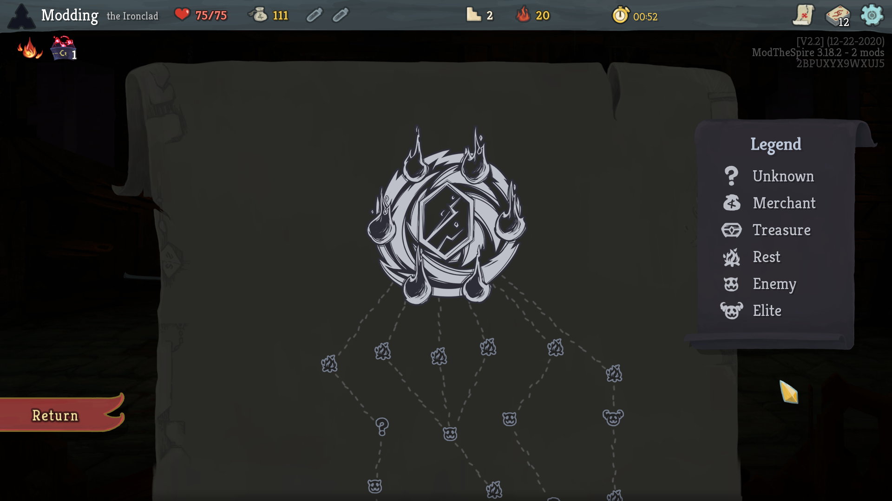

## Dark Map *(beta branch only)*

Gives the map a dark theme for the late night spire slayer.

### Notes
* Only works on the beta branch of Slay the Spire (11-17-2020 patch) - this mod will not work on the main branch! Check out [My BaseMod patch](https://github.com/casey-c/basemod/releases) for a temporary solution to get mods working on the beta branch.
* Due to how it patches the base game render calls, it is most likely incompatible with other map coloring mods (e.g. colored map nodes etc.) - but they are probably not fully working on the current beta branch anyway due to the devs tweaking things in the beta branch.

### Additional Info
* This mod is a spin off of my upcoming map improvement mod (which itself is a sequel to BetterPaths) - when that project releases this mod will most likely be obsolete (and incompatible as it will touch the same code). Stay tuned for that mod in the near future.
* This mod will likely not see any further updates and is only being released as a small hold-over until the main map mod is completed.

### Installation

Requires ModTheSpire and [my beta branch BaseMod patch](https://github.com/casey-c/basemod/releases). Note: If you're new to my forked version of BaseMod, you'll have to unsubscribe from the real basemod to use it due to the version numbers being behind. At the time of posting, the real base mod is still not yet updated to support anything beyond the main branch due to the instability of beta changes.

To install this mod, download the latest version at the [releases page](https://github.com/casey-c/DarkMap/releases) and place them into your SlayTheSpire/mods folder.

### Issues / Feedback

If you run into bugs, incompatibilities, or have further suggestions, please let me know about them over on the [issues page](https://github.com/casey-c/DarkMap/issues).
